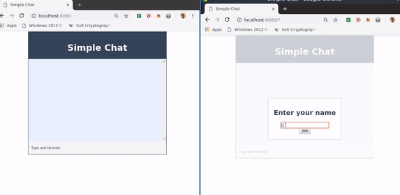

# Simple Chat

## Features

* React 16
* Webpack 4
* Babel 7
* NodeJS

## Installation

* `git clone git@https://github.com/miniatureweasle/chat.git`
* cd chat 
* npm install
* node src/server.js
* npm start
* visit `http://localhost:8080/`
